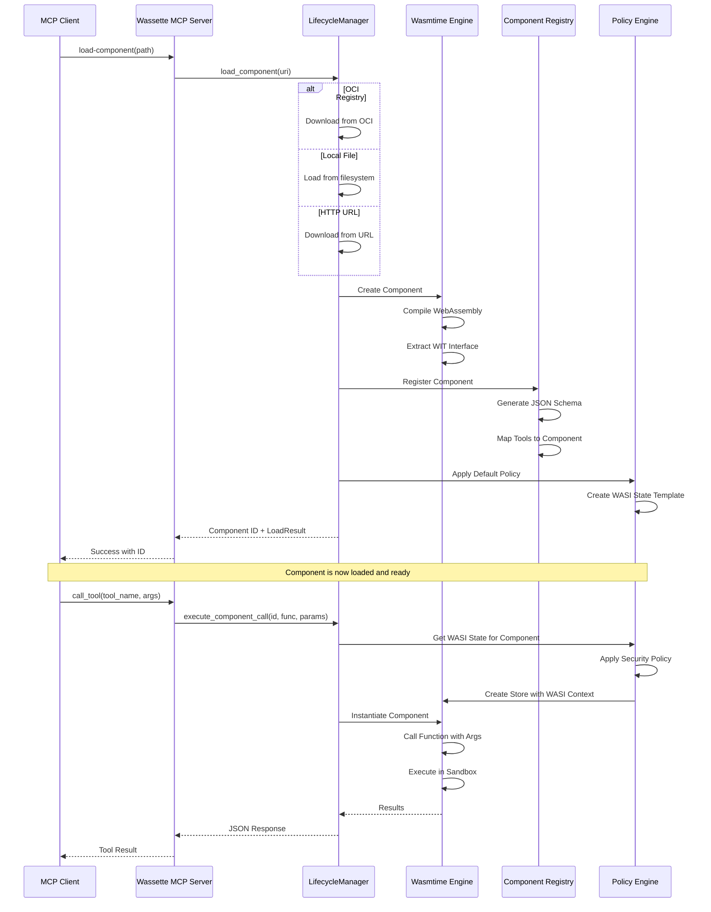

```mermaid
sequenceDiagram
    participant Client as MCP Client
    participant Server as Wassette MCP Server
    participant LM as LifecycleManager
    participant Engine as Wasmtime Engine
    participant Registry as Component Registry
    participant Policy as Policy Engine
    
    Client->>Server: load-component(path)
    Server->>LM: load_component(uri)
    
    alt OCI Registry
        LM->>LM: Download from OCI
    else Local File
        LM->>LM: Load from filesystem
    else HTTP URL
        LM->>LM: Download from URL
    end
    
    LM->>Engine: Create Component
    Engine->>Engine: Compile WebAssembly
    Engine->>Engine: Extract WIT Interface
    
    LM->>Registry: Register Component
    Registry->>Registry: Generate JSON Schema
    Registry->>Registry: Map Tools to Component
    
    LM->>Policy: Apply Default Policy
    Policy->>Policy: Create WASI State Template
    
    LM-->>Server: Component ID + LoadResult
    Server-->>Client: Success with ID
    
    Note over Client,Policy: Component is now loaded and ready
    
    Client->>Server: call_tool(tool_name, args)
    Server->>LM: execute_component_call(id, func, params)
    
    LM->>Policy: Get WASI State for Component
    Policy->>Policy: Apply Security Policy
    Policy->>Engine: Create Store with WASI Context
    
    LM->>Engine: Instantiate Component
    Engine->>Engine: Call Function with Args
    Engine->>Engine: Execute in Sandbox
    
    Engine-->>LM: Results
    LM-->>Server: JSON Response
    Server-->>Client: Tool Result
```