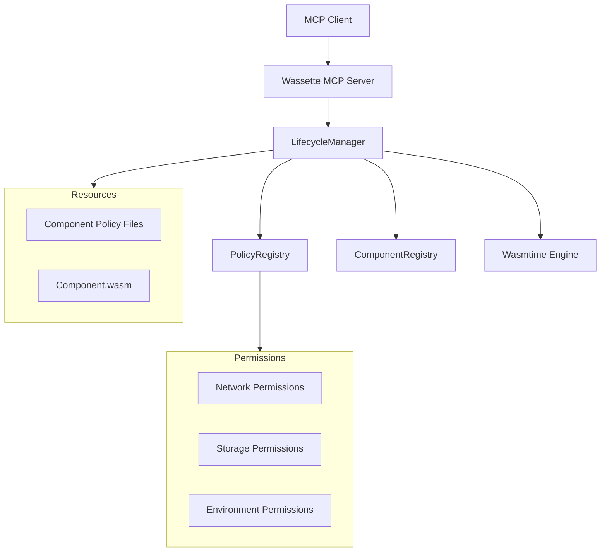

# Permission System Design


- Author: @Mossaka
- Date: 2025-07-11


## Overview

The permission system provides fine-grained, per-component capability controls in the Wassette MCP server. This document describes the architecture,implementation, and future development plans.

## Architecture Overview

### Core Components



### Key Design Principles

- **Per-Component Policies**: Each component has its own permission policy, co-located with the component binary under the `plugin_dir` directory
- **Principle of Least Privilege**: Components only get permissions they need
- **Dynamic Control**: Permissions can be granted at runtime using the `grant-permission` tool


## Current Implementation Status

### 1. Per-Component Policy System

**Status**: ✅ **Implemented**

Each component can have its own policy file stored as `{component_id}.policy.yaml` co-located with the component binary.

```rust
// Current Implementation
struct PolicyRegistry {
    component_policies: HashMap<String, Arc<WasiStateTemplate>>,
}

impl LifecycleManager {
    async fn get_wasi_state_for_component(&self, component_id: &str) -> Result<WasiState> {
        // Returns component-specific WASI state or default restrictive policy
    }
}
```

### 2. Policy Lifecycle Management

**Status**: ✅ **Implemented**

Built-in tools for managing component policies:

- `attach-policy`: Attach policy from file:// or https:// URI
- `detach-policy`: Remove policy from component
- `get-policy`: Get policy information for component

### 3. Granular Permission System

**Status**: ✅ **Implemented**

The `grant_storage_permission` method allows atomic permission grants:

```rust
pub async fn grant_storage_permission(
    &self,
    component_id: &str,
    details: &serde_json::Value,
) -> Result<()>
```

The `grant_network_permission` method allows atomic permission grants:

```rust
pub async fn grant_network_permission(
    &self,
    component_id: &str,
    details: &serde_json::Value,
) -> Result<()>
```

Supported permission types:
- **Network**: `{"host": "api.example.com"}`
- **Storage**: `{"uri": "fs:///path", "access": ["read", "write"]}`

### 4. Policy Persistence

**Status**: ✅ **Implemented**

- Policies are stored co-located with components
- Policy associations are restored on server restart
- Metadata tracking for policy sources

## Built-in Tools

1. `get-policy`: Get policy information
2. `grant-storage-permission`: Grant storage access
3. `grant-network-permission`: Grant network access
4. `load-component`: Load WebAssembly component
5. `unload-component`: Unload component
6. `list-components`: List loaded components

## Permission Types and Structure

### Policy File Format

```yaml
version: "1.0"
description: "Component-specific security policy"
permissions:
  network:
    allow:
      - host: "api.example.com"
      - host: "cdn.example.com"
  environment:
    allow:
      - key: "API_KEY"
      - key: "CONFIG_URL"
  storage:
    allow:
      - uri: "fs:///tmp/workspace"
        access: ["read", "write"]
      - uri: "fs:///var/cache"
        access: ["read"]
```

## Future Development Roadmap

- Policy Signing: Verify policy integrity with signatures
- Policy Checksums: Verify downloaded policy integrity
- **Policy Caching**: Optimize policy loading and parsing
