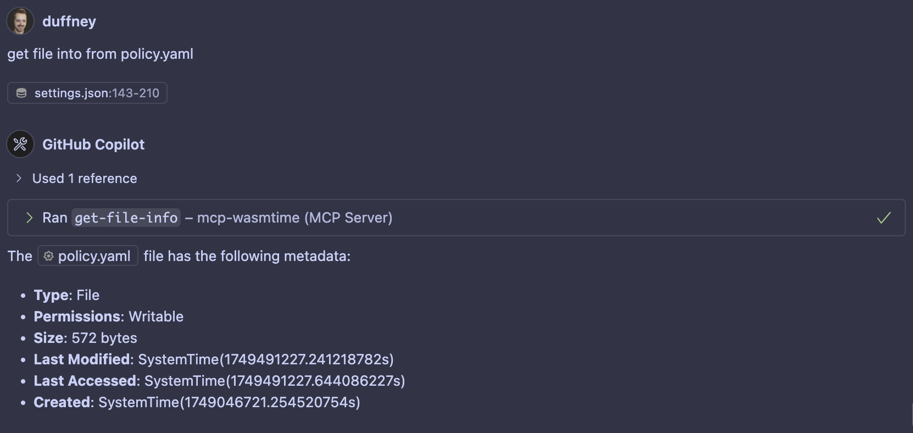

# Filesystem Example

This example demonstrates the use of the `wassette` runtime to interact with the filesystem as a WebAssembly (Wasm) component. It showcases how to define and enforce permissions for accessing files and directories using a policy file.

## Tools

- **Read File**: Read the contents of a file within allowed directories.
- **List Directory**: List the contents of a directory, distinguishing between files and directories.
- **Search Files**: Recursively search for files matching a pattern.
- **Get File Info**: Retrieve metadata about a file or directory.

## Setup

1. **Add MCP Server to VS Code**:

   - Open your `settings.json` file in VS Code.
   - Add the MCP server configuration under the `mcp.servers` section. Example:
     ```json
     "mcp": {
       "servers": {
         "wassette": {
           "type": "sse",
           "url": "http://127.0.0.1:9001/sse"
         }
       }
     }
     ```

2. **Start the MCP Server**:

   - Use the `Justfile` to start the server with the appropriate policy file:
     ```bash
     just run-filesystems
     ```

3. **Run a Filesystem Tool**:

   - Use the agent in VS Code to execute a filesystem tool, such as `read_file` or `get_file_into`. Ensure the tool is configured to use the MCP server.

   

## Policy File

By default, WebAssembly (Wasm) components do not have any access to the host machine. The `policy.yaml` file is used to explicitly define what paths and permissions are made available to the component through the WebAssembly System Interface (WASI). This ensures that the component can only access the resources that are explicitly allowed.

Example:

```yaml
version: "1.0"
description: "Permission policy for filesystem access in wassette"
permissions:
  storage:
    allow:
      - uri: "fs:///Users/USERNAME/github/wassette"
        access: ["read"]
      - uri: "fs:///Users/USERNAME"
        access: ["read"]
      - uri: "fs:///"
        access: ["read"]
```
