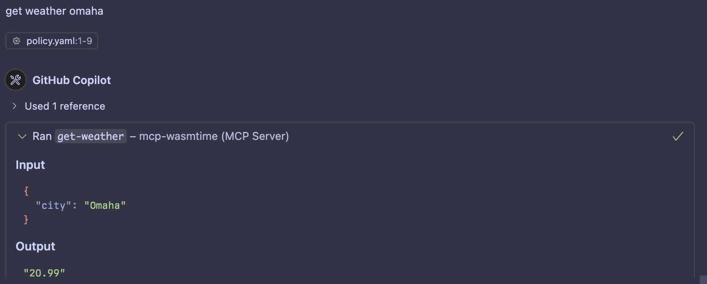

# Get Weather Example

This example demonstrates the use of the `wassette` runtime to interact with a weather API as a WebAssembly (Wasm) component. It showcases how to define and enforce permissions for accessing network resources and environment variables using a policy file.

## Tools

- **Get Weather**: Fetches the current weather for a specified city using the OpenWeather API.

## Setup

1. **Add MCP Server to VS Code**:

   - Open your `settings.json` file in VS Code.
   - Add the MCP server configuration under the `mcp.servers` section. Example:
     ```json
     "mcp": {
       "servers": {
         "wassette": {
           "type": "sse",
           "url": "http://127.0.0.1:9001/sse"
         }
       }
     }
     ```

2. **Set the OpenWeather API Key**:

   - Obtain an API key from [OpenWeather](https://openweathermap.org/api).
   - Export the API key as an environment variable:
     ```bash
     export OPENWEATHER_API_KEY="your_api_key_here"
     ```

3. **Start the MCP Server**:

   - Use the `Justfile` to start the server with the appropriate policy file:
     ```bash
     just run-get-weather
     ```

4. **Run the Weather Tool**:

   - Use the agent in VS Code to execute the weather tool and fetch the weather for a city with a prompt like "Get weather for Omaha".

   

## Policy File

By default, WebAssembly (Wasm) components do not have any access to the host machine or network. The `policy.yaml` file is used to explicitly define what network resources and environment variables are made available to the component. This ensures that the component can only access the resources that are explicitly allowed.

Example:

```yaml
version: "1.0"
description: "Permission policy for wassette weather demo"
permissions:
  network:
    allow:
      - host: "api.openweathermap.org"
  environment:
    allow:
      - key: "OPENWEATHER_API_KEY"
```
