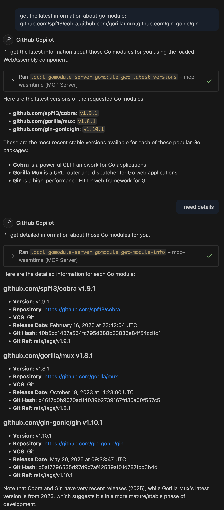

# gomodule Example

This example demonstrates the use of the `wassette` runtime to interact with the Go module server as a WebAssembly (Wasm) component. It showcases how to define and enforce permissions for accessing network resources and environment variables using a policy file.

## Tools

- **Get Latest Version**: Get the latest version of a Go module.
- **Get Module Info**: Get detailed information about a Go module.

